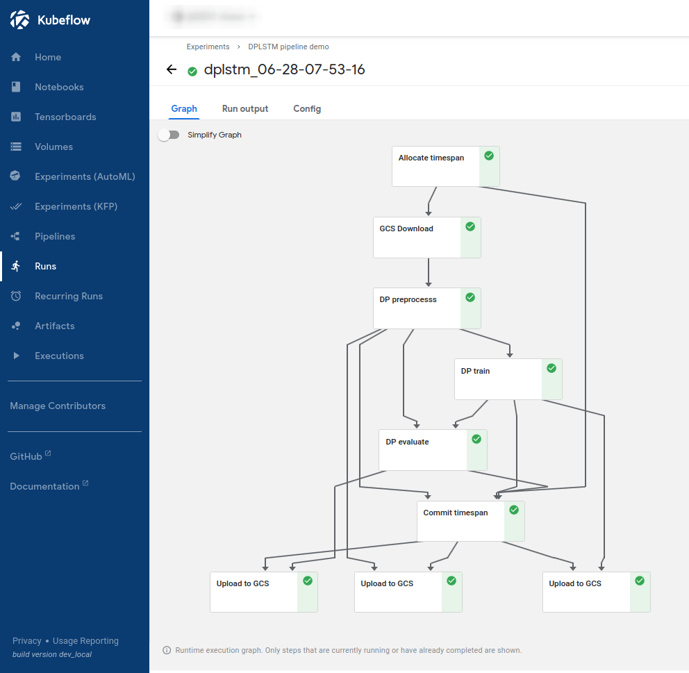

# PrivateKube

PrivateKube is an extension to the popular Kubernetes datacenter orchestrator that adds privacy as a new type of resource to be managed alongside other traditional compute resources, such as CPU, GPU, and memory.  A description of the project can be found on our [webpage](https://systems.cs.columbia.edu/PrivateKube/) and in our OSDI'21 paper, titled [Privacy Budget Scheduling](https://www.usenix.org/conference/osdi21/presentation/luo) (PDF locally available [here](https://columbia.github.io/PrivateKube/papers/osdi2021privatekube.pdf) and extended version available on [arXiv](https://arxiv.org/abs/2106.15335)).


## Repo structure

This repository contains the artifact release for the OSDI paper:
- [system](system/): The PrivateKube system, which implements the privacy resource and a new scheduling algorithm for it, called *Dominant Privacy Fairness (DPF)*.
- [privatekube](privatekube/): A Python client for interaction with the PrivateKube system and performing macrobenchmark evaluation.
- [simulator](simulator/): A simulator for microbenchmarking privacy scheduling algorithms in tightly controlled settings.
- [examples](examples/): Usage examples for various components, please refer its [README](./examples/README.md) for details.
- [evaluation](evaluation/): Scripts to reproduce the macrobenchmark and microbenchmark evaluation results from our paper.

## Instruction structure
- [PrivateKube](#privatekube)
  - [Repo structure](#repo-structure)
  - [Instruction structure](#instruction-structure)
  - [1. Getting started with PrivateKube](#1-getting-started-with-privatekube)
    - [1.1 Requirements](#11-requirements)
    - [1.2. Deploying PrivateKube](#12-deploying-privatekube)
      - [Download the code](#download-the-code)
      - [Create a Python environment](#create-a-python-environment)
      - [Deploy PrivateKube to your cluster](#deploy-privatekube-to-your-cluster)
    - [1.3. Hello World](#13-hello-world)
    - [1.4. Example usage in a DP ML pipeline](#14-example-usage-in-a-dp-ml-pipeline)
  - [2. Getting started with the simulator](#2-getting-started-with-the-simulator)
    - [2.1 Setup](#21-setup)
      - [Setup a Python environment](#setup-a-python-environment)
      - [Installation from source](#installation-from-source)
    - [2.2 Examples](#22-examples)
      - [The minimal simulation example](#the-minimal-simulation-example)
      - [How to analyze simulation results](#how-to-analyze-simulation-results)
    - [2.3 How to reproduce microbenchmark evaluation](#23-how-to-reproduce-microbenchmark-evaluation)


## 1. Getting started with PrivateKube

This section explains how to install the system and walks through a simple example of interaction with the privacy resource. It should take less than 30 mins to complete.

### 1.1 Requirements

PrivateKube needs a Kubernetes cluster to run. If you don't have a cluster, you can install a lightweight Microk8s cluster on a decent laptop. Kubeflow requires more resources but it is not required in this section.

Below are the instructions to install and configure a lightweight cluster on Ubuntu. For other platforms, see [https://microk8s.io/](https://microk8s.io/).

```bash
sudo snap install microk8s --classic
```


Check that it is running:
```bash
microk8s status --wait-ready
```

You can add your user to the `microk8s` group if you don't want to type `sudo` for every command (you should log out and log in again after this command):
```
sudo usermod -a -G microk8s $USER

mkdir ~/.kube

sudo chown -f -R $USER ~/.kube
```
(You can learn more about how to use Microk8s without sudo [here](https://github.com/ubuntu/microk8s/blob/feature/dev-docs/docs/access-without-sudo.md))

You can now start and stop your cluster with:
```bash
microk8s start 

microk8s stop
```

Export your configuration:
```bash
microk8s config > ~/.kube/config
```

Declare an alias to use `kubectl` (you can add this line to your `.bash_profile` or equivalent):
```bash
alias kubectl=microk8s.kubectl
```

Check that you can control your cluster:
```bash
kubectl get pods -A
```


### 1.2. Deploying PrivateKube

#### Download the code

Clone this repository on your machine. Our scripts will only affect this repository (e.g. dataset, logs, etc.) and your cluster, not the rest of your machine.

```bash
git clone https://github.com/columbia/PrivateKube.git
```

Enter the repository:
```bash
cd PrivateKube
```

All the other instructions in this file have to be run from this `PrivateKube` directory, unless specified otherwise. 


#### Create a Python environment

Create a new virtual environment to interact with PrivateKube, for instance with:

```bash
conda create -n privatekube python=3.8

conda activate privatekube
```

Install the dependencies:
```bash
pip install -r privatekube/requirements.txt
```

Install the PrivateKube package:
```bash
pip install -e privatekube
```

#### Deploy PrivateKube to your cluster

You can deploy PrivateKube in one line and directly by running:

```bash
source system/deploy.sh
```

If you prefer to understand what is going on, you can run the following commands one by one:

First, let's create a clean namespace to separate PrivateKube from the rest of the cluster:

```bash
kubectl create ns privatekube
```

Then, create the custom resources:

```bash
kubectl apply -f system/privacyresource/artifacts/privacy-budget-claim.yaml

kubectl apply -f system/privacyresource/artifacts/private-data-block.yaml
```

You can now interact with the privacy resource like with any other resource (e.g. pods). `pb` is a short name for private data block, and `pbc` stands for privacy claim. You can list blocks and see how much budget they have with: `kubectl get pb -A`. So far, there are no blocks nor claims, but in the next section (1.3.) we will add some.

We already compiled the controllers and the scheduler and prepared a Kubernetes deployment that will pull them from DockerHub. Launch the privacy controllers and the scheduler:

```bash
kubectl apply -f system/dpfscheduler/manifests/cluster-role-binding.yaml

kubectl apply -f  system/dpfscheduler/manifests/scheduler.yaml
```

There are additional instructions in the [system directory](system/) if you want to modify the scheduler or run it locally.


### 1.3. Hello World

Open a first terminal. We are going to monitor the logs of the scheduler to see it in action. Find the scheduler pod with:

```bash
kubectl get pods -A | grep scheduler
```

Then, in the same terminal, monitor the logs of the scheduler with something similar to:
```bash
kubectl logs --follow dpf-scheduler-5fb6886497-w7x49 -n privatekube 
```

(alternatively, you can directly use: `kubectl logs --follow "$(kubectl get pods -n privatekube | grep scheduler | awk -F ' ' '{print $1}')" -n privatekube`)

Open another terminal. We are going to create a block and a claim and see how they are being scheduled.

Create a new namespace for this example:

```bash
kubectl create ns privacy-example
```

Check that there are no datablocks or claims:

```bash
kubectl get pb -A
```

Add a first datablock:

```bash
kubectl apply -f examples/privacyresource/dpf-base/add-block.yaml
```

List the datablocks to see if you can see your new block:

```bash
kubectl get pb --namespace=privacy-example
```


Check the initial budget of your block:

```bash
kubectl describe pb/block-1 --namespace=privacy-example
```

Add a privacy claim:

```bash
kubectl apply -f examples/privacyresource/dpf-base/add-claim-1.yaml
```

Describe the claim:
```bash
kubectl describe pbc/claim-1 --namespace=privacy-example
```

On your first terminal, you should see that the scheduler detected the claim and is trying to allocate it. Wait a bit, and check the status of the claim again to check if it has been allocated. You can also check the status of the block again.

Finally, clean up:
```bash
kubectl delete -f examples/privacyresource/dpf-base/add-claim-1.yaml 
kubectl delete -f examples/privacyresource/dpf-base/add-block.yaml
kubectl delete namespace privacy-example
```

We now have a proper abstraction to manage privacy as a native Kubernetes resource.  The next section will provide an end-to-end example for how to interact with the privacy resource through a real machine learning pipeline.  You can also refer to [evaluation/macrobenchmark](evaluation/macrobenchmark) to reproduce part of our evaluation of this resource and the DPF algorithm we developed for it.

### 1.4. Example usage in a DP ML pipeline

The [examples/pipeline](examples/pipeline) directory contains a step-by-step guide to build a DP ML pipeline with PrivateKube.




## 2. Getting started with the simulator

This simulator is used for prototyping and microbenchmark evaluation of privacy budget scheduling algorithms. It supports controlled evaluation of DPF against baseline algorithms, including round-robin and first-come-first-serve.


### 2.1 Setup

#### Setup a Python environment
Install Conda, create and activate an isolated Python environment "ae". 
```bash
wget https://repo.anaconda.com/miniconda/Miniconda3-latest-Linux-x86_64.sh -O ~/miniconda.sh
bash ~/miniconda.sh -b -p $HOME/miniconda
eval "$($HOME/miniconda/bin/conda shell.bash hook)"
conda init
conda create -n ae  -c conda-forge pypy3.6 pip python=3.6 seaborn notebook -y
conda activate ae
```

#### Installation from source
Install a Python package called dpsched via
 
```bash
cd ./simulator
pip install -r ./requirements.txt
pip install .[plot]
```


### 2.2 Examples
#### The minimal simulation example
[examples/simulator/minimal_example.py](examples/simulator/minimal_example.py) gives a quick start. There are two key concepts in the simulation program:
1. The simulation model: This implements how different components in the systems behave and interact with each other. One can import it via `from dpsched import Top`
2. The configuration dictionary: a dictionary that specifies many aspects of the simulation behavior. for configuration details, please refer to the comments in [minimal_example.py](examples/simulator/minimal_example.py).

 Basically, there are two steps in [minimal_example.py](examples/simulator/minimal_example.py).
 1. Preparing the config dictionary
 2. Calling `simulate(config, Top)`, where `config` is the config dict and `Top` is the simulation model.

To run the minimal example:
```bash
cd ./examples/simulator
python ./minimal_example.py
``` 
or, replace CPython with PyPy for better performance:
```bash
cd ./examples/simulator
pypy ./minimal_example.py
```

The simulation program saves experiment results in a workspace specified by a config dictionary. By default, it is saved under `./examples/exp_results/some_work_space_name`.

#### How to analyze simulation results
`dpsched.analysis` contains modules for collecting experiment result from workspace directory and plotting various figures.
[evaluation/microbenchmark/microbenchmark_figures_single_block.ipynb](evaluation/microbenchmark/microbenchmark_figures_single_block.ipynb) gives examples on how to use the `dpsched.analysis` module with detailed comments. 

### 2.3 How to reproduce microbenchmark evaluation

Instructions and code for how to use the simulator to reproduce the microbenchmark results in the PrivateKube paper are in [`evaluation/microbenchmark/README.md`](./evaluation/microbenchmark/README.md).
