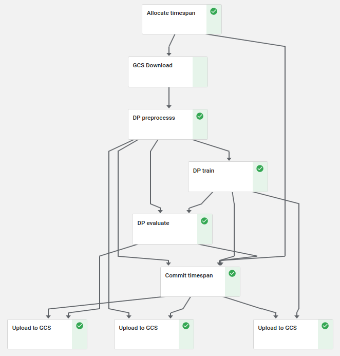

# Pipeline example

 This is an end-to-end example of pipeline using Kubeflow Pipelines and PrivateKube to train an LSTM on a subset of the Amazon Reviews dataset.

## Overview

We will:
- deploy PrivateKube and initialize some privacy blocks
- compile the DP preprocessing, training and evaluation components
- build a DP pipeline with PrivateKube wrappers to allocate and consume some privacy budget
- run the pipeline on Kubeflow


#### Requirements

You will need a Kubernetes cluster with Kubeflow 1.3 deployed on Google Cloud Platform. This [guide](https://www.kubeflow.org/docs/distributions/gke/deploy/overview/) from the Kubeflow documentation explains how to obtain such a setup.

More precisely, will use Google Kubernetes Engine, Google Cloud Engine (for the cluster), Google Cloud Storage (to store the artifacts) and Google Cloud Registry (to store the component images).

## Step-by-step guide

### Deploy PrivateKube

Once your Kubeflow cluster is ready and configured, follow the [instructions](https://github.com/columbia/PrivateKube#12-deploying-privatekube) to deploy PrivateKube.


### Authenticate

Create a configuration file for your cluster and container registry:

```bash
cp client_secrets.example.yaml client_secrets.yaml
vim client_secrets.yaml
```

The Kubeflow client id and secret can be retrieved with [these instructions](https://www.kubeflow.org/docs/distributions/gke/pipelines/authentication-pipelines/).


Similarly, add a cluster role binding to authorize Kubeflow to manipulate the privacy resource:

```bash
cp user-role_secrets.example.yaml user-role_secrets.yaml
vim user-role_secrets.yaml
kubectl apply -f user-role_secrets.yaml
```

### Create some blocks

Now that the cluster is configured, you can deploy some private data blocks. We prepared a public dataset with some preprocessed Amazon Reviews. Each block contains the data for 1 day for 1/100th of the users, in HDF5 format. 

The following script will create some blocks automatically on your cluster:

```bash
python demo_blocks.py create --days 10 --users 1
```

### Build the components

This step is optional, since we prebuilt the components used in the pipeline and published them on [DockerHub](https://hub.docker.com/u/privatekube).

If you want to create your own pipeline, you should modify the Kubeflow components such as [dp_evaluate](dp_evaluate/) or [dp_train](dp_train/). These components are Docker images containing some machine learning functionalities (e.g., preprocessing or neural network training with PyTorch), along with a Yaml interface specifying the inputs and the outputs for Kubeflow Pipelines.

You can build these components automatically with:

```bash
python  build_components.py
```

You can also modify the `allocate` and `consume` components to your needs (for instance if you want to request by user ids). The source for these components is [here](https://github.com/columbia/PrivateKube/tree/main/privatekube/privatekube/kfp). Once you're done with the modifications, you can build a container image by hand or reuse our script:

```bash
 python build_components.py ~/PrivateKube/privatekube/privatekube/kfp/components_src/claim
```

### Write and run the pipeline

The [run_pipeline.py](run_pipeline.py) uses Kubeflow's DSL to build a pipeline with the components. 

Here is the corresponding graph:



The structure of the pipeline is similar to the one described in the [OSDI paper](https://columbia.github.io/PrivateKube/papers/osdi2021privatekube.pdf):
1. We request some private data blocks
2. We download the corresponding data
3. We process this data and use it to train a DP machine learning model
4. We consume the privacy budget that we used
5. We publish the result of the computation

Once the pipeline is ready, you can fill-in the runtime arguments in [arguments.yaml](arguments.yaml).

Then, the following command will compile the pipeline and send it to your cluster to be processed:

```bash
python run_pipeline.py
```

The first time you run this script, your terminal might prompt you to authenticate your connection to Kubeflow with your Google account.


### Examine the results

Finally, you can head to your Kubeflow dashboard to check the result of the pipeline. The upload components will use the Google storage bucket you specified to write their outputs.

You can also examine the scheduler logs and the privacy resources as explained in the [main README](https://github.com/columbia/PrivateKube#13-hello-world).


## Troubleshooting

### Cleaning-up
To delete all the blocks and all the claims:

```bash
kubectl delete pbc --all -n privacy-example

kubectl delete pb --all -n privacy-example
```

### Adding GPU support

You can add some options to the components of the Kubeflow pipeline. For instance, to retry the training twice and run on a GPU with at most 6 CPUs, you can add:

```python
    dp_train_task.set_gpu_limit(1)
        .set_cpu_limit("6")
        .set_retry(1)
```

### Scheduler

To restart the scheduler, you can delete the pod and let the deployment spawn a fresh instance:

```bash
kubectl delete pod "$(kubectl get pods -n privatekube | grep scheduler | awk -F ' ' '{print $1}')" -n privatekube
```

To start the scheduler with new parameters (e.g., a lower value of N so you can allocate pipelines without waiting too much), you can edit the [deployment file](https://github.com/columbia/PrivateKube/blob/main/system/dpfscheduler/manifests/scheduler.yaml) and apply your changes with `kubectl apply -f scheduler.yaml`.

### Caching

Kubeflow offers a cache thanks to ML Metadata. It is extremely useful to speed up similar components and to debug pipelines. However, this cache can interfere with PrivateKube's privacy claims: if the component and the inputs are identical, Kubeflow can reuse the same private data blocks without running the allocation component again, thus overspending privacy budget. To avoid this, we [deactivate caching](https://www.kubeflow.org/docs/components/pipelines/caching/#managing-caching-staleness) for privacy claims.